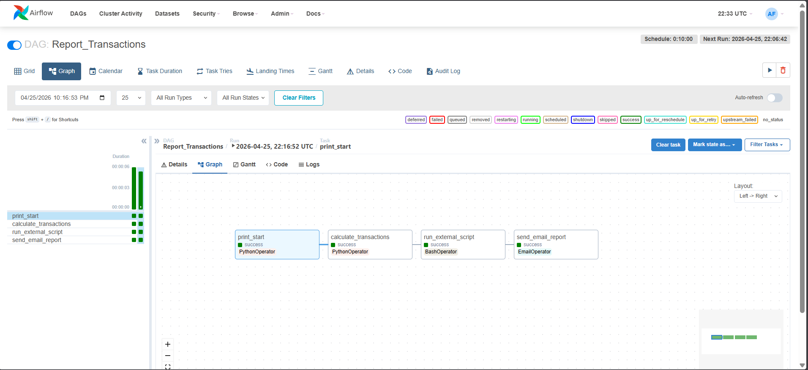

# 🚀 Automated Transaction Reporting Pipeline

An end-to-end data orchestration pipeline built with Apache Airflow for near real-time financial transaction processing, reporting, and notification delivery.

---

## 📌 Overview

The **`Report_Transactions`** DAG runs every 10 minutes, enabling continuous processing of transaction data and timely report distribution.

This project demonstrates a complete workflow:
- Data processing
- External script execution
- Automated email reporting

---

## 📷 ScreenShot


---

## ⚙️ Key Features

### 🔹 Modular Workflow Design
- `PythonOperator` → Data processing  
- `BashOperator` → External script execution  
- `EmailOperator` → Notifications  

---

### 🔹 Data Processing & Integrity
- Aggregates transaction data  
- Generates a persistent report file  
- Ensures consistent and traceable outputs  

---

### 🔹 External Script Integration
- Executes external Python script (`app.py`) via Bash  
- Shows orchestration beyond Airflow-native tasks  

---

### 🔹 Automated Reporting
- Sends HTML email reports to stakeholders  
- Enables near real-time monitoring  

---

## 🛠️ Tech Stack

| Component      | Technology      |
|---------------|----------------|
| Orchestration | Apache Airflow |
| Language      | Python 3       |
| Scripting     | Bash           |
| Environment   | Linux / Docker |

---

## ⏱️ Scheduling

- **Frequency:** Every 10 minutes  
- **Goal:** Near real-time transaction reporting  

---

## 📊 Pipeline Workflow

```text
print_start
    ↓
calculate_transactions
    ↓
run_external_script
    ↓
send_email_report
